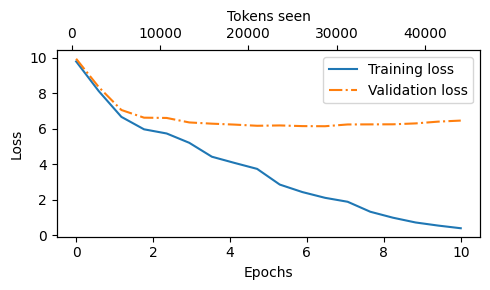
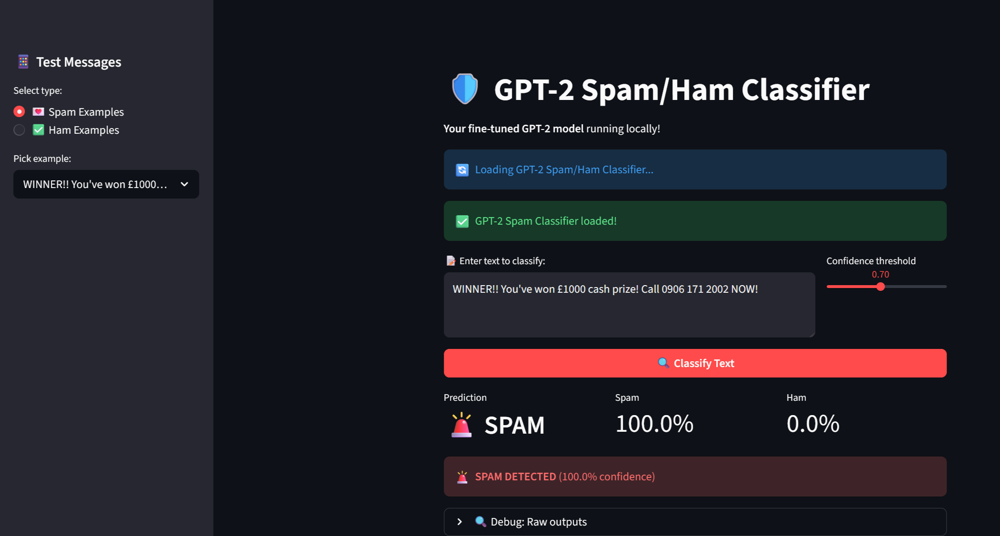

# Project: Build Small Language Models (GPT‑2 124M) From Scratch
---

A step‑by‑step project series focused on understanding how Large Language Models are built from the ground up — from preprocessing and attention mechanisms to pre‑training, fine‑tuning, and evaluation.

**Objective:** Train readers to think like fundamental machine learning engineers, not just API users.

---

## 1. End‑to‑End Pipeline

1. Download SMS Spam dataset  
2. Balance classes (747 spam, 747 ham)  
3. Split into train / validation / test  
4. Create Datasets & DataLoaders (tokenization + padding)  
5. Initialize GPT‑2 with pretrained OpenAI weights  
6. Replace LM head (768→50257) with classification head (768→2)  
7. Implement accuracy & cross‑entropy loss  
8. Fine‑tune using AdamW; monitor train/val metrics  
9. Evaluate on full datasets  
10. Run inference on new messages; save checkpoint  

---

## 2. Data Preprocessing — SMS Spam Collection

**Dataset:** 5,572 messages  
- Ham: 4,825 (86%)  
- Spam: 747 (13%)  

**Structure:**  
- `label` → ham / spam  
- `message` → raw SMS text  

### 2.1 Class Balancing

Original ratio ≈ 6:1 (ham:spam).  
Random undersampling applied → **747 ham + 747 spam (balanced dataset)**.

### 2.2 Label Encoding & Split

- ham → 0  
- spam → 1  

Split (fixed random seed):  
- Train 70%  
- Validation 10%  
- Test 20%  

---

## 3. Handling Variable-Length Text

### 3.1 Problem

Emails have different token lengths (15, 45, 120 tokens), but models require fixed shape: [batch_size, max_length]

### Options

- **Truncate** → loses information  
- **Pad** → preserves full content ✅  

**Solution:** Pad using GPT‑2 `<|endoftext|>` (ID = 50256).

---

### 3.2 Workflow: Text → Tokens → Batch

| Step | Operation | Example |
|------|------------|----------|
| 1 | Text | `"Ok lar... FREE entry..."` |
| 2 | Tokenize | `[5037, 878, ..., 3187]` |
| 3 | Pad | Append `50256` until `max_length` |
| 4 | Batch | `[batch_size, max_length]` |
| 5 | Labels | `[0, 1, 0, 1, ...]` |

---

## 4. Supervised Fine‑Tuning with Classification Head

**Architecture Modification:**  
Replace GPT‑2 LM head with **classification head (768→2)**.  
Use **last token representation** for prediction.

---

## Model Architecture – Classification Head

---

## 5. From Model Output to Prediction

### 5.1 Logits

- Output shape: `[batch_size, seq_len, 2]`  
- Select last token → `[batch_size, 2]`  
- Example: `[-3.5983, 3.9902]` → `[ham, spam]`

### 5.2 Prediction

- Apply `argmax` on logits  
  - 0 → ham  
  - 1 → spam  
- Softmax optional (argmax unchanged)

---

## 6. Model Performance Summary

| Stage | Metric | Train | Val | Test | Notes |
|-------|--------|--------|------|------|-------|
| Baseline | Accuracy | 46% | 45% | 48% | Worse than chance |
| Initial | Loss | High | High | High | Before training |
| After Training | Loss | 0.083 | 0.074 | — | Minimal overfitting |
| During Training* | Accuracy | 100% | 97.5% | — | `eval_iter=5` |
| Final Evaluation | Accuracy | 97% | 97% | 95% | ~2% gap |

**Interpretation:** Slight but acceptable overfitting.

---

## Loss Curves Comparison

<table>
  <tr>
     <td align="center">
     </td> 
     <strong>Pre-Training Loss Curve</strong> 
     
     </td>
     <td align="center">
     <strong>Fine-Tuning Loss Curve</strong> 
     
     </td>
  </tr>
</table>

---

## 7. Generalization to Other Domains

The same pipeline applies to any text classification task.

### 7.1 General Applications

- Product reviews (positive/negative)  
- Medical diagnosis (disease/no disease)  
- Support tickets (priority levels)  

### 7.2 Finance Applications

- Financial news sentiment (bullish/bearish/neutral)  
- Earnings call analysis (positive/negative outlook)  
- Loan approval prediction (approve/reject)  
- Credit risk classification (low/medium/high)  
- Fraud detection (fraud/not fraud)  
- Insurance claim screening (legitimate/suspicious)  
- ESG compliance classification  

✅ Keep preprocessing & architecture  
✅ Only modify final classification head (e.g., 3 or 5 classes)

---

## 8. Deployment

- Lightweight GPT‑2 (124M) suitable for edge/mobile optimization  
- Streamlit UI demo for inference visualization  
- Model checkpoint export for production use  

---

## Streamlit Classifier App UI_Demo

 

asset\Accuracy_1.png

asset\GPT-2_classification head.jpg
asset\GPT-2_classifier_App.png
asset\Loss_Epochs_Fine tune LLM_output_2.png
asset\Loss_Epochs_pre-traingLLM_output.png

---

---

## Fine-Tuning Loss Curve

---

## Pre-Training Loss Curve

